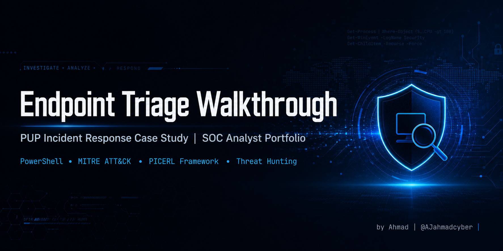

<div align="center">



#  Endpoint Triage Walkthrough

### A Real-World PUP Incident Response Case Study

[](https://github.com/AJahmadcyber/endpoint-triage-walkthrough)
[](https://www.sans.org/cyber-security-courses/)
[](https://attack.mitre.org/techniques/T1543/003/)
[](LICENSE)

</div>

---

##  Tools & Technologies

<div align="center">


</div>

---

##  Executive Summary

> A symptom-driven endpoint triage investigation that uncovered a multi-service Potentially Unwanted Program (PUP) consuming approximately **10% of total CPU uptime**. The investigation followed the **PICERL incident response framework**, mapped findings to **MITRE ATT&CK**, and produced detection content for SOC deployment.

### Key Outcomes

| Metric              | Before        | After         | Improvement     |
|---------------------|---------------|---------------|-----------------|
| Top CPU Consumer    | 44,392 sec    | 25 sec        | -99.9%          |
| CPU Temperature     | 76C           | 53C           | -23C            |
| WebView2 Instances  | 13            | 0             | -100%           |
| Memory Compression  | 1.1 GB        | < 200 MB      | -82%            |
| Bloat Services      | 8             | 0             | -100%           |

---

##  Investigation Overview

### Initial Symptoms
- Laptop overheating during normal use (76C idle)
- Sluggish performance despite no heavy applications running
- Fans running at high RPM continuously
- System: ThinkPad, Windows 11, 16 GB RAM

### Hypothesis Formation
Heat without legitimate cause typically indicates a runaway background process. The investigation pivoted to identifying CPU consumers and their legitimacy.

---

##  Triage Methodology

The investigation followed the **PICERL framework**: Preparation -> Identification -> Containment -> Eradication -> Recovery -> Lessons Learned.

###  Key Technique: CPU Time Accumulator Analysis

Standard task managers show *current* CPU usage, but **accumulated CPU time** since boot reveals long-running outliers:CPU % of uptime = (Process_CPU_Time / (System_Uptime  CPU_Cores))  100
**Rule of thumb:**
- Normal background process: < 1% of uptime
- Worth investigating: 1-5%
- Strong outlier: > 5% (in this case, the PUP was at ~10%)

---

##  Key Finding

**Process:** `rsEngineSvc.exe` (ReasonLabs RAV Engine)
**CPU Time:** 44,392 seconds (~12 hours of CPU time)
**Verdict:** Resource-heavy PUP exhibiting persistence behaviors similar to T1543.003

### The Suite Revealed

Further enumeration uncovered an 8-service suite, not just one process:

| Service | Function | Concern |
|---------|----------|---------|
| rsEngineSvc | Core engine | High CPU consumption |
| rsClientSvc | Client agent | Persistent connection |
| rsEDRSvc | EDR module | Kernel-level monitoring |
| rsDNSResolver | DNS interception | Traffic redirection |
| rsDNSSvc | DNS service | Same as above |
| rsVPNSvc | VPN client | Network manipulation |
| rsWSC | Windows Security Center | Defender interference |
| rsSyncSvc | Update sync | C2-like beacon pattern |

---

##  MITRE ATT&CK Mapping

| Technique  | Name                                              | Observed Behavior                          |
|------------|---------------------------------------------------|--------------------------------------------|
| T1543.003  | Create or Modify System Process: Windows Service  | 8 persistent services installed            |
| T1547.001  | Registry Run Keys / Startup Folder                | Multiple autostart entries (3 layers)      |
| T1071.004  | Application Layer Protocol: DNS                   | Custom DNS resolvers intercepting traffic  |
| T1562.001  | Impair Defenses: Disable/Modify Tools             | Windows Security Center manipulation       |

---

##  Repository Structure
 README.md

 LICENSE

 .gitignore

    05-lessons-learned.md

    04-mitre-mapping.md

    03-eradication.md

    02-investigation.md

    01-initial-triage.md

 docs/                    # Detailed PICERL walkthrough

    sigma-reasonlabs.yml # Sigma rule for installation detection

 detections/              # SIEM-ready detection content

    audit-startup.ps1    # Multi-layer persistence audit

    check-system.ps1     # Quick health check

 scripts/                 # PowerShell triage automation

 assets/                  # Banner & visualizations

endpoint-triage-walkthrough/
---

##  Quick Start

### Clone the Repository

```bash
git clone https://github.com/AJahmadcyber/endpoint-triage-walkthrough.git
cd endpoint-triage-walkthrough
```

### Run the Triage Script

```powershell
powershell -ExecutionPolicy Bypass -File .\scripts\check-system.ps1
```

---

##  Detailed Documentation

The full investigation is broken down into five stages, each documenting one phase of the PICERL framework:

| Stage | Document | Description |
|-------|----------|-------------|
| 1 | [Initial Triage](docs/01-initial-triage.md) | Symptom analysis & process enumeration |
| 2 | [Investigation](docs/02-investigation.md) | Service mapping & persistence discovery |
| 3 | [Eradication](docs/03-eradication.md) | Removal procedures & verification |
| 4 | [MITRE Mapping](docs/04-mitre-mapping.md) | ATT&CK technique correlation |
| 5 | [Lessons Learned](docs/05-lessons-learned.md) | Detection engineering & key takeaways |

---

##  Skills Demonstrated

- **Incident Response**  PICERL framework execution
- **Endpoint Forensics**  Live triage on Windows hosts
- **PowerShell Investigation**  Process, registry, and WMI enumeration
- **Process Tree Analysis**  Parent-child relationship mapping
- **Persistence Hunting**  Multi-layer registry analysis
- **MITRE ATT&CK**  Technique mapping and behavioral analysis
- **Detection Engineering**  Sigma rule development
- **Threat Hunting**  Anomaly identification through statistical analysis

---

##  Disclaimer

This case study documents the removal of **ReasonLabs RAV**, which is a legitimate commercial product, not malware. However, its behavior  multi-service persistence, DNS interception, and Windows Security Center modification  overlaps with techniques used by adversaries. This walkthrough demonstrates triage methodology applicable to both legitimate PUPs and malicious software.

The techniques and scripts in this repository are intended for **defensive purposes**: endpoint health audits, threat hunting practice, and SOC analyst training.

---

##  Author

**Ahmad Abuzarqa**
*SOC Analyst Trainee | Cybersecurity Student | Jordan*

[](https://github.com/AJahmadcyber)
[](mailto:ahmad.j.abuzarqa@gmail.com)

**Currently pursuing:**  CyberDefenders CCDL1
**Focus areas:** SOC operations, threat detection, incident response, detection engineering

---

##  License

This project is licensed under the MIT License  see the [LICENSE](LICENSE) file for details.

---

<div align="center">

### If this walkthrough helped you, consider giving it a star!

**Made by a SOC analyst, for SOC analysts.**

</div>
